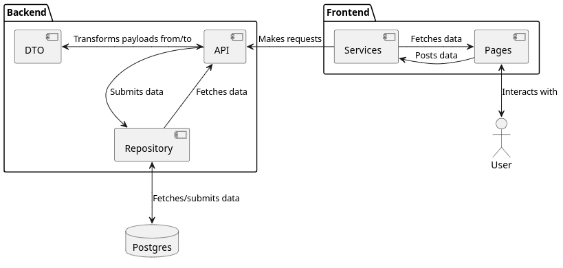

<!-- jump_to_middle -->

## 1. Introduction
---

Framework comparisons

<!-- end_slide -->

Foreword
---

It is important to note that the technologies being demonstrated here are all self-declared **not** production ready.

<!-- pause -->

Therefore, expect bugs and inconsistencies, and apply the knowledge acquired here with caution.

<!-- pause -->

With that being said, the APIs of the used frameworks have mostly stayed the same throughout the last few years, and, while breaking changes are bound to happen, it's safe to assume most of what is being presented today will remain relevant once they stabilize.

<!-- pause -->

What we will be learning today
---

<!-- column_layout: [1, 1] -->

<!-- column: 0 -->

- How to write a backend Rust application from scratch
    - REST API / JSON
    - Database connection
    - ORM
    - Many-To-Many relationships

<!-- column: 1 -->

- How to write a frontend Rust application from scratch
    - SSR vs CSR
    - Hydration
    - Backend resource fetching
    - Reactivity

<!-- reset_layout -->

<!-- pause -->

What we won't be learning today
---

- How to style components
    - That's beyond Rust and Leptos: that's CSS
- Authorization/Authentication
    - There's not enough time to cover both backend and frontend while also dealing with this
    - Besides, there are multiple ways of doing these, and they all depend on the context of the application
    - Take a look at [loco.rs](https://loco.rs/) for an integrated built-in solution

<!-- end_slide -->

Backend Framework Comparison
---

Currently, Rust features 3 major backend frameworks:

<!-- column_layout: [1, 1] -->

<!-- column: 0 -->

# Axum


- Newest/Freshest 
- Fastest *practical* web framework 
- *Almost* no macro usage 
    - *leads to faster compile times*
- Core of [loco.rs](https://loco.rs/) 
- No official guide *yet* ****

<!-- column: 1 -->

# Actix Web


- Richest Ecosystem 
    - 876 results on [crates.io](https://crates.io/)
- Built-in test client 
- Very detailed official guide 

<!-- column_layout: [1, 5] -->

<!-- column: 0 -->

# Rocket


<!-- column: 1 -->

- Oldest web framework 
- Almost 1:1 with Actix Web's API
- **Fantastic** official guide 
    - Begginner *friendlier*
- Most built-in integrations 
    - `diesel`, `sqlx`, `rustqlite`, `memcache`, `tera`, ...
- Maintenance problems ****

**We'll be using Rocket today!**

<!-- end_slide -->

ORM Comparison
---

<!-- column_layout: [1, 1] -->

<!-- column: 0 -->

# Diesel


- SQL-first approach ****
    - Rust types based off SQL's
- Features an official `rocket` integration 
- Few concepts to learn before using it 
    - All core traits are `derive`*able*

<!-- column: 1 -->

# SeaORM


- Rust-first approach 
    - Migrations written in Rust
- Async-first 
- Lots of concepts and traits to learn before using ****
    - Non-`derive`*able* traits
    - Naming-sensitive `struct`s and `enum`s

<!-- reset_layout -->

SeaORM is far too complex for the time we have, so **Diesel** is gonna be our ORM of choice today.

<!-- end_slide -->

Frontend Comparison
---

Rust has a huge frontend ecosystem, with crates such as Leptos, Yew, Dioxus, Sycamore and Slint UI.

Leptos and Yew are web-centered and feature syntaxes heavily inspired by React and JSX/TSX.

Dioxus and Sycamore use syntax similar to HTML, and Dioxus specifically can be used to build web, desktop and even terminal interfaces.

Slint UI brings own a whole new file format (*.slint*) with its own styling and interface syntaxes. Its web-export is still beta, however.

<!-- pause -->

<!-- column_layout: [1, 4] -->

<!-- column: 0 -->


<!-- column: 1 -->

# Leptos

For the purposes of today's demo, we are gonna be using Leptos, which brings a more familiar syntax, while having less boilerplate than Yew.

```rust +line_numbers {1-6,12}
#[component]
fn Doubler() -> impl IntoView {
    let (value, set_value) = create_signal(1);
    let on_click = move |_| {
        set_value.update(|val| *val *= 2);
    };

    view! {
        <button on_click>Double it</button>
        <p>Value: {value}</p>
    }
}
```

<!-- end_slide -->

<!-- jump_to_middle -->

## 2. Rust Refresher
---

Refreshing some concepts that will be used by the frameworks of our choice.

<!-- end_slide -->

## 2.1. Types of macros

### Function-macros

<!-- column_layout: [7, 4] -->

<!-- column: 0 -->

```rust +line_numbers
// Leptos example
view! {
    <button on_click=|_| logging::debug_warn!("Hi!")>
        "Check your console!"
    </button>
}
```

<!-- column: 1 -->

- Used like functions, end with an exclamation mark `!`
- Don't necessarily use round parentheses `()`, can use any of the 3
- Manipulate the tokens received to change the whole expression

<!-- reset_layout -->

<!-- pause -->

### Attribute-macros

<!-- column_layout: [6, 4] -->

<!-- column: 0 -->

- Annotates items such as structs (*and fields*), enums (*and variants*), functions, etc.
- Also replaces the whole expression with zero or more outputs

<!-- column: 1 -->

```rust +line_numbers
// Rocket Example
#[get("/")]
async fn hello_world() -> &'static str {
    "Hello, World!"
}
```

<!-- reset_layout -->

<!-- pause -->

### Derive-macros

<!-- column_layout: [1, 1] -->

<!-- column: 0 -->

```rust +line_numbers
// Serde example
#[derive(Serialize, Deserialze)]
struct LotteryResponseJson {
    winning_numbers: [u8; 6],
    your_numbers: Vec<u8>,
    win: bool,
}
```

<!-- column: 1 -->

- Annotates structs and enums
- Used to automatically implement traits with logic that depends on reflection
    - Ex: Debug, Clone, serde's Serialize and Deserialize

<!-- reset_layout -->

<!-- end_slide -->

## 2.2. Rust's Memory Model and Multi-Threading

In Rust, memory from the stack is often shared mutably or immutably via regular references `&mut _` and `&_`. These references are valid for as long as the scope in which the variables were created is valid.

However, when dealing with multiple threads, no data from the stack can *safely* be shared. Therefore, it's common to `.clone()` or move the data before sending it out to another thread.

<!-- pause -->

### Closures

Closures are anonymous functions that capture the context around them. This means that closures can use data from the current scope, without needing to clone or own it (*by borrowing*).

Unsurprisingly, if a closure is sent to another thread, it may outlive the data it borrows from. *Safe* Rust, of course, wouldn't allow it, resulting in a compilation error.

<!-- column_layout: [1, 1] -->

<!-- column: 0 -->

```rust
fn main() {
    let y = {
        // Simulating the scope of another thread
        let x = String::from("X value");
        || x.as_str()
    };

    print_result(y);
}

fn print_result<'a, F: Fn() -> &'a str>(f: F) {
    println!("Res: {}", f());
}
```

<!-- pause -->

<!-- column: 1 -->

```rust
 --> t.rs:4:9
  |
4 |         || x.as_str()
  |         ^^ - `x` is borrowed here
  |         |
  |         may outlive borrowed value `x`
note: block requires argument type to outlive `'1`
 --> t.rs:2:9
2 |     let y = {
  |         ^
help: to force the closure to take ownership
    [..] use the `move` keyword
4 |         move || x.as_str()
  |         ++++
```

<!-- reset_layout -->

On such cases, the `move` keyword can be used to force the closure to take ownership of the data it'd borrow from.

<!-- end_slide -->

## 3. Project Structure
---

